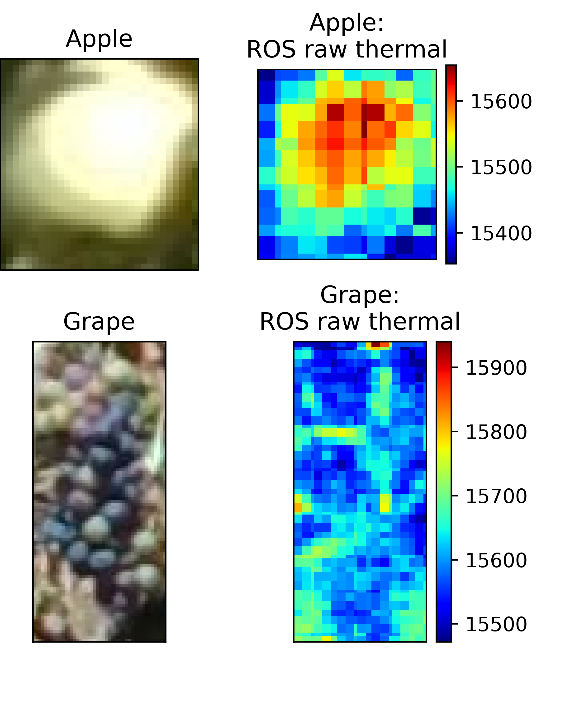
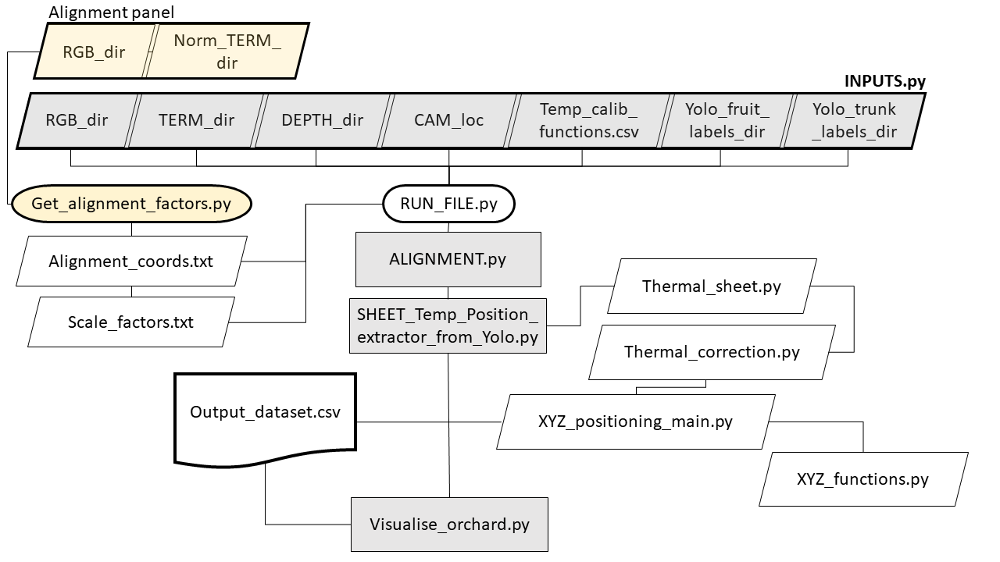
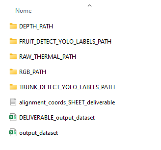
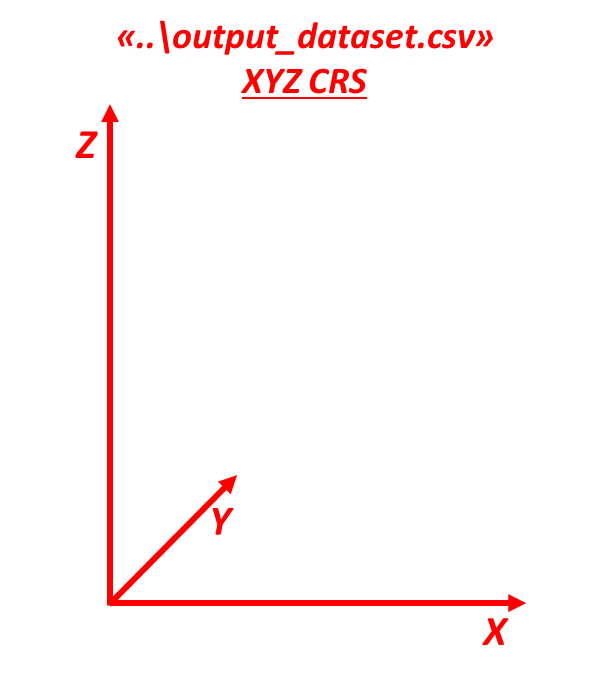
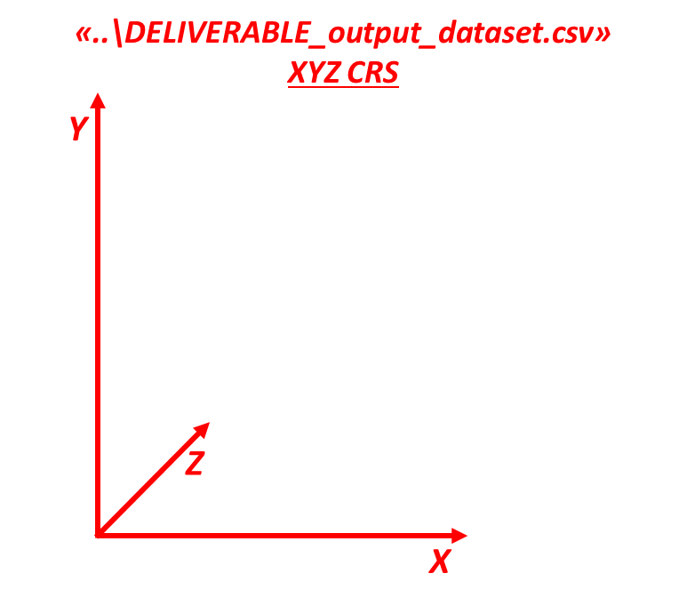

# Sunburn and HEat Prediction in canopies for Evolving a warning tech solution (SHEET) 🍎🍇
project funded by ICT - AGRI FOOD, *December 2022*

_______

## Understanding the code
To better understand the following code and its purpose, it is strongly suggested to download and have a read at "D2.2-SHEET_RGB-D-Thermal system.pdf", 
since this repository contains the code described in the aforementioned D2.2 deliverable ***"Fruit (Apple and grape cluster) Thermal and 
Positional data extraction by means of RGB-D/Thermal cameras, neural networks and computer vision"*** 

## **Clone the sheet_prj environment**

To clone the "sheet_prj" conda environment needed to run the code, download 'environment.yml' within the "conda_env" folder. 
After it, surf to the downloaded folder containing the '.yml' file and run the following command:

    conda env create --file environment.yml

After it, activate the required environment
    
    conda activate sheet_prj

## **Run the code**

The whole code is contained inside the **SHEET_RGBDT_system** folder of the current repository.

* `Get_alignment_factors.py` - run this script when performing the RGBD (Intel Realsense D435) and thermal image (SEEK 
Compact Pro) alignment to get the .txt files to be supplied inside `INPUTS.py`. Examples of images to be supplied to this 
script are contained inside "SHEET_RGBDT_system/" within the "colore" (= color) and "termico" (= thermal) folders.

* `INPUTS.py` - compile this script with the required information and directories. It is important to include "\_img\_" 
in the RGB filenames and "\_thermal\_" in the filenames of raw thermal images.

>   ##### Required inputs
>   1. `SPECIE` - define the fruit tree under analysis ('apple' or 'grape').
>   2. `IMAGE_CARDINAL_FACE` - define the tree side shot in the pictures - East (e), Weast (w), North (n), South (s).
>   3. `TRUNK_DIST` - shooting distance in metres (*m*) between RGBD/T cameras and trees.
>   4. `ALIGNMENT_COORDS` - path to the `alignment_coords_SHEET_deliverable.txt` file produced by `Get_alignment_factors.py`.
>       The file is used for RGB-D/T images alignment, and it can be found at the following project directory: 
> 
>           SHEET_RGBD-T_system_v_2022 > SHEET_RGBDT_system > colore 
> 
>   5. `IMAGE_FORMAT` - input images file format (.png, .jpg) - better to use .png.
>   6. `RGB_PATH` - path to the folder storing the RGB images taken from the field with proper filenames.
>
>          fuji_2022-08-04-09-44-15_img_31.png
> 
>   7. `DEPTH_PATH` - path to the folder storing the depth images taken from the field. 
>
>          fuji_2022-08-04-09-44-15_depth_31.png
>
>   8. `RAW_THERM_PATH` - path to the folder storing the ROS - generated thermal images taken from the field.
>
>          fuji_2022-08-04-09-44-15_thermal_31.png
>
>   9. `FRUIT_DETECT_YOLO_LABELS_PATH` - path to the folder storing the YOLO .txt labels produced with the fruit detection.
>   10. `TRUNK_DETECT_YOLO_LABELS_PATH` - path to the folder storing the YOLO .txt labels produced with the trunk detection.
>11. `OUTPUT_DF_PATH` - define path and filename of the `.csv` file where to store the primary output file - i.e., the file with XYZ coordinates system useful for data visualisation.
>       
>            directory = "..\output_dataset.csv"
> 
>   12. `DELIVERABLE_OUTPUT_DF_PATH` - define path and filename of the `.csv` file where to store the secondary output file - i.e., the file with XYZ coordinates system useful for data interpretation.
>
>           directory = "..\DELIVERABLE_output_dataset.csv"

>   13. `TH_CALIBRATION` - path to the .txt file containing data about distance effect on temperature estimation. 
>   These data must be directly obtained from channel 2 and 3 of the .Tiff files produced with the SEEK Compact pro mobile APP.
>   The .txt file must be organised as showed in the following Table, with ***separator = " "***.

| dist | Raw min | Raw max | Raw avg | C min | C max | C avg | IFOV_mm            |
|---|---|---|---------|-------|-------|-------|--------------------|
| 0.5 | 2132 | 6662 | 3723.86 | 0.78  | 56.81 | 23.16 | 2.62               |
| 1.0 | 2168 | 6498 | 3733.16 | 1.20  | 54.98 | 23.25 | 5.23               |
| 1.5 | 2188 | 6354 | 3752.02 | 1.56  | 53.37 | 23.56 | 7.85               |
| 2.0 | 2208 | 6264 | 3750.72 | 2.16  | 52.34 | 23.58 | 10.47              |
| 2.5 | 2252 | 6146 | 3761.66 | 3.03  | 51.06 | 23.74 | 13.08 |
| 3.0 | 2278 | 6016 | 3752.88 | 3.74  | 49.71 | 23.76 | 15.70 |

>> ###### Table structure
>> + ***dist*** = distance obj - camera in metres (*m*)
>> + ***Raw min*** = bbox minimum thermal raw value
>> + ***Raw max*** = bbox maximum thermal raw value
>> + ***Raw avg*** = bbox average thermal raw value
>> + ***C min*** = bbox minimum Celsius value
>> + ***C max*** = bbox maximum Celsius value
>> + ***C avg*** = bbox average Celsius value
>> + ***IFOV_mm*** = camera Istantaneous Field of View (*millimetres*) at the given distance, and calculated on a 3x3 pixels matrix.

Since in future versions of the code, the `INPUTS.py` script will be improved, it is strongly suggested to organise all 
the primary data into a unique directory as showed in the following image.

* `RUN_file.py` - run this python file to make the program work.
It runs a workflow of the following processes:

> 1. ***RGBD/T alignment***, performed by the `ALIGNMENT.py` script.
> 2. ***Fruit temperatures and XYZ positions extraction***, performed by the `SHEET_Temp_Position_extractor_from_Yolo.py` script.
> 3. ***3D visualisation of the primary data*** stored within the `output_dataset.csv`. The script `Visualise_orchard.py` will produce three plots:
>    - whole extracted data plotted together
>    - single tree plot with relative coordinates ranging from 0 to 1
>    - single tree plot with relative coordinates in millimetres.
> 

Currently, it is needed to specify within the `Visualise_orchard.py` script, the image filename from which plotting fruit temperatures in the 3D space.

    grape_image_fn_to_filter_data_for = '2022-08-03-12-06-54_img_0001'
    apple_image_fn_to_filter_data_for = 'gala_2022-08-04-10-43-57_img_01'
> 4. ***Dataset conversion*** from primary to secondary dataset, performed by the `reordering_output_CSV_for_DELIVERABLE.py` script.
>
>> ##### Primary dataset's coordinate reference system
> 
>> ##### Secondary dataset's coordinate reference system
>  

### Launching `RUN_file.py`:
The `RUN_file.py` script it is composed of few lines of code, which manage the required workflow.

    # RGBD-T alignment
    start = time.time()
    exec(open('ALIGNMENT.py').read())

    # temperature and position extraction of each detected object and output dataframe creation
    exec(open('SHEET_Temp_Position_extractor_from_Yolo.py').read())
    end = time.time()
    
    # visualisation
    exec(open('Visualise_orchard.py').read())

    # modify the dataset to change XYZ axis
    exec(open('reordering_output_CSV_for_DELIVERABLE.py').read())
    print(f'\nminutes {(end - start)/60}')

Thanks to this execution architecture, it is possible to activate or deactivated specific processes by commenting their executive line.
For example, the following `RUN_file.py` is commented in order to only show previously obtained data.

    # RGBD-T alignment
    start = time.time()
    # exec(open('ALIGNMENT.py').read())

    # temperature and position extraction of each detected object and output dataframe creation
    # exec(open('SHEET_Temp_Position_extractor_from_Yolo.py').read())
    end = time.time()
    
    # visualisation
    exec(open('Visualise_orchard.py').read())

    # modify the dataset to change XYZ axis
    # exec(open('reordering_output_CSV_for_DELIVERABLE.py').read())
    print(f'\nminutes {(end - start)/60}')
_____

The code authors are *[Mirko Piani](https://www.linkedin.com/in/mirko-piani-7b411a1a2/)* and 
*[Gianmarco Bortolotti](https://www.linkedin.com/in/gianmarco-bortolotti-a02aa8154/)* from the fruit trees department
([DISTAL](https://distal.unibo.it/en/index.html)) of the University of Bologna (IT).
Reach out our group [ECOPOM](https://www.linkedin.com/company/ecopom/?viewAsMember=true) on LinkedIn 🚀

